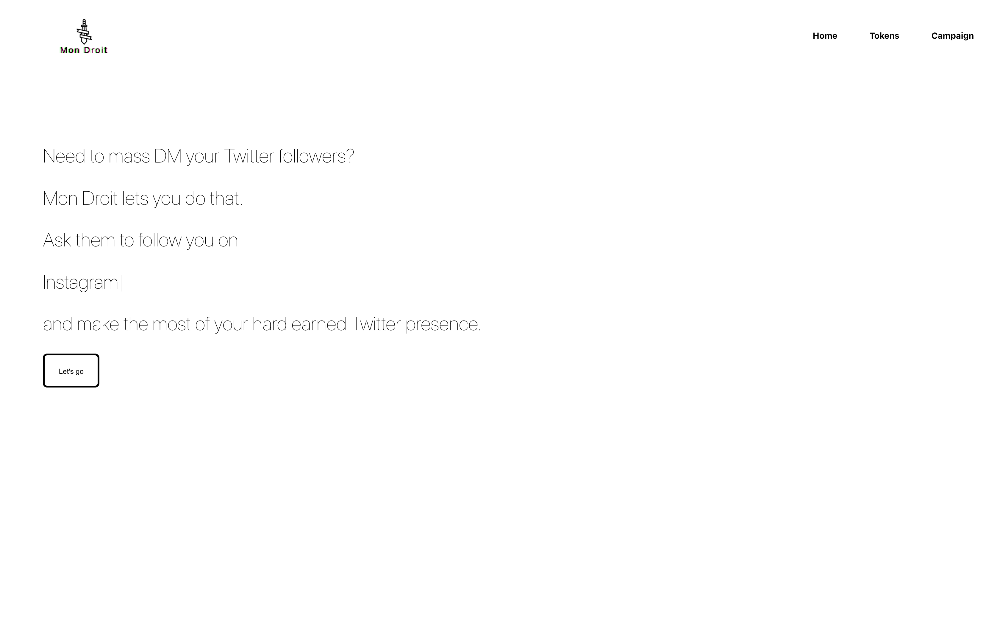
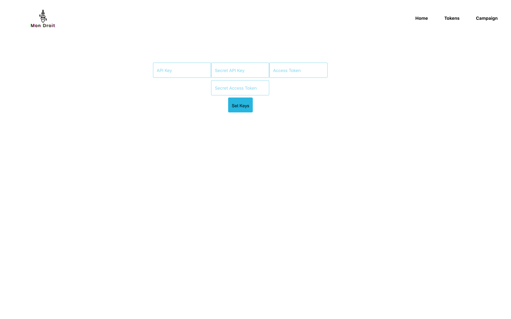
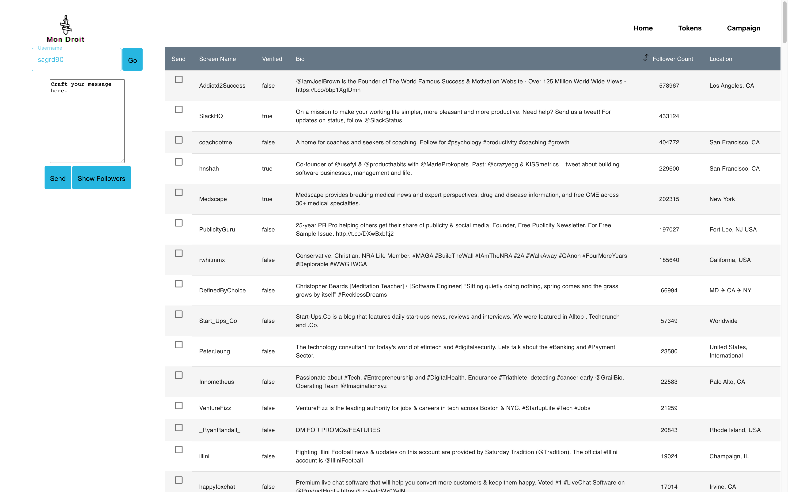

# Mon Droit

An app that lets users DM their twitter followers en masse.

A bit of a background. Mon Droit is French for 'my right,' it comes from the motto of the English crown, 'dieu et mon droit, honi soit qui mal y pense' 'god and my right, shame on he who thinks evil of it.' It only felt right that those who have built their own empires on twitter have the right to take their followers to other locales (platforms), and perhaps see what comes of it.

6/30 Update: new Dark Mode

Screenshots below:

## Home

## Tokens page

## Campaign page

## Tech Stack:

Frontend: React

Backend: Flask

DB: json files stored locally

## Installation

### `pipenv shell` to start a shell environment

### `export FLASK_APP=backend.py`

### `flask run` to start the backend server

### `npm install` to install the frontend

### `npm run start` to run the app locally

### Future additions

- Status updates on a particular campaign, especially useful for campaigns that may span multiple days (1000+ DMs)

- A campaigns page to show previous campaigns

- Overall speed optimizations across the board

- Will look into implementing saasify

- Table component is better constructed, data virtualiziation, select all button, pagination, among other additions
